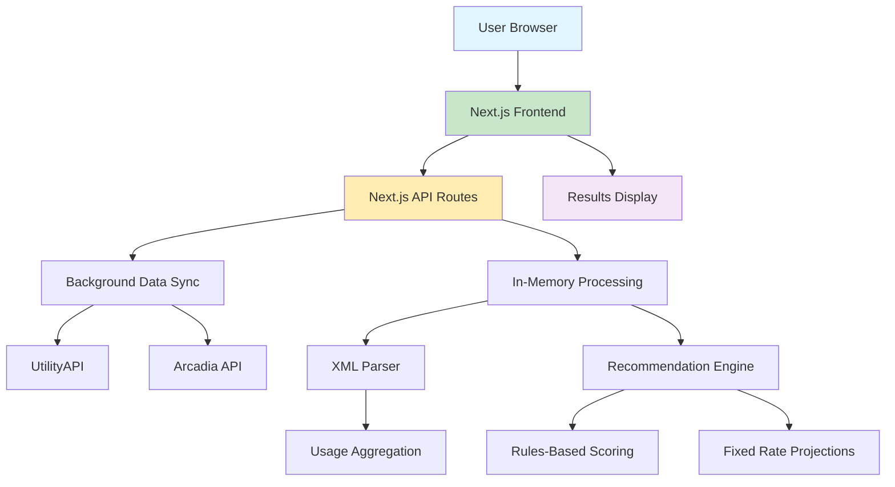
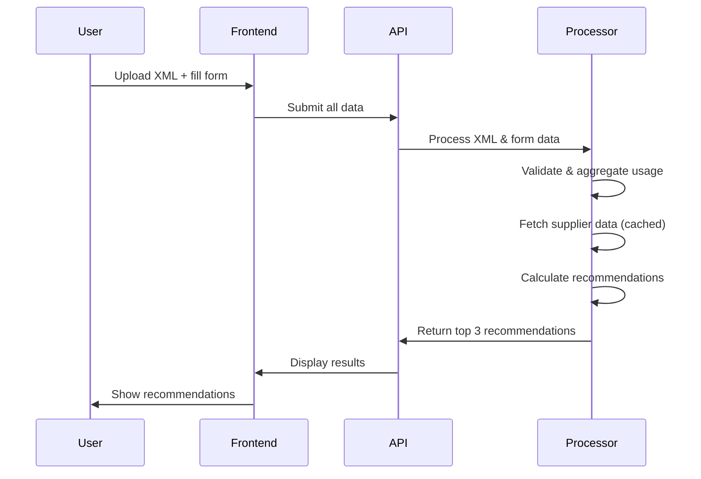
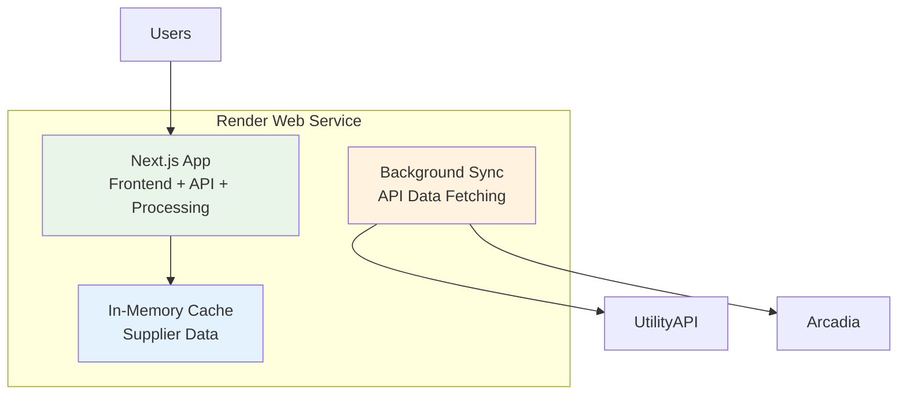

# Energy Plan Recommendation Agent - Architecture

## System Overview

## Component Details

### Frontend (Next.js)
- **Progressive Web Form**: 5-step input collection in single page
- **File Upload**: Green Button XML with rigorous validation
- **Results Display**: Recommendation cards with detailed metrics
- **State Management**: React state for form flow (no persistence)

### Backend (Next.js API Routes)
- **API Endpoints**:
  - `POST /api/process-data` - Process form data and XML
  - `GET /api/recommendations` - Get top 3 recommendations
- **Data Validation**: Comprehensive input and business logic validation
- **Processing**: Direct data processing without external services

### Data Processing (Node.js)
- **XML Parsing**: Robust Green Button ESPI parsing with error recovery
- **Data Aggregation**: Hourly → monthly usage summaries with validation
- **Supplier Data Sync**: Background API fetching (UtilityAPI + Arcadia)
- **Cost Calculations**: Fixed-rate projections with all fee components

### Data Storage (MVP)
- **In-Memory**: Temporary processing data (no persistence)
- **Background Cache**: Supplier data cached in memory with refresh

### External Integrations
- **UtilityAPI**: Supplier catalog and utility data
- **Render**: Hosting and deployment platform

## Data Flow

## Deployment Architecture (Render)

## Key Design Decisions

### MVP Simplifications
- **Monolithic Architecture**: Single Next.js app with frontend, API, and processing
- **No User Management**: Single-session webapp, no authentication or persistence
- **In-Memory Processing**: Temporary data storage, no database for MVP
- **Fixed Rates Only**: Focus on simplest rate structure for initial validation
- **Background API Sync**: Real-time supplier data fetching on app startup
- **Rigorous Validation**: Comprehensive input and data quality validation

### Scalability Considerations
- **Service Separation**: Background worker pattern for heavy processing
- **Database Optimization**: TimescaleDB for efficient time-series queries
- **Caching Layer**: Redis for frequently accessed supplier data (future)
- **CDN**: Static asset delivery for frontend performance

## Security & Privacy

- **Data Encryption**: TLS for all external communications
- **Input Validation**: Sanitize all user inputs and file uploads
- **API Keys**: Secure storage for third-party integrations
- **Data Retention**: User data deletion capabilities
- **GDPR Compliance**: User consent and data export features

## Performance Targets

- **Recommendation Generation**: < 5 seconds (MVP), < 2 seconds (final)
- **Page Load**: < 2 seconds initial load, < 1 second subsequent
- **API Response**: < 500ms for simple queries
- **File Upload**: Support up to 10MB XML files

## Monitoring & Observability

- **Error Tracking**: Sentry integration for error monitoring
- **Performance Monitoring**: Response times and throughput
- **User Analytics**: Form completion rates and drop-off points
- **Business Metrics**: Recommendation acceptance rates
